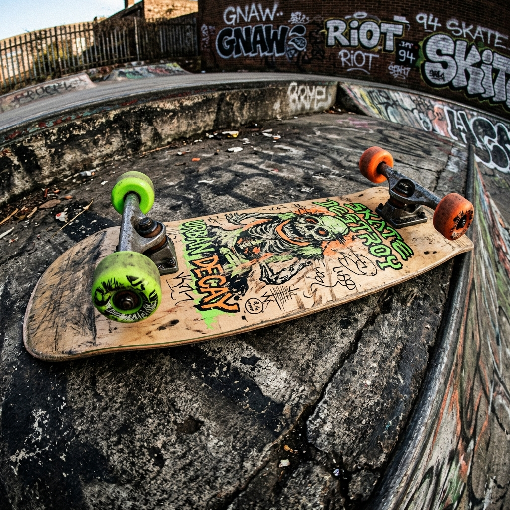

# 🛹 SKATE STOPPER - The Pure Skateboarding Game

<div align="center">
  
  <p><em>90s VHS Tape & Skate Zine Trivia Experience</em></p>
</div>

---

## 📹 ¿Qué es Skate Stopper?

**Skate Stopper** es un juego interactivo de trivia y catalogación de trucos de skate con una estética retro de cinta VHS y revista de los 90 (estilo *Transworld Skateboarding* / *Thrasher*).

Permite importar partes de vídeo de YouTube (o rondas completas de skate), catalogar el momento exacto en el que el skater hace el pop, etiquetar el truco detalladamente (con stance, rotación, flips, grinds, manuals, stalls, endings to fakie/revert, etc.) y retar a amigos o jugar en solitario a adivinar los trucos justo antes de que ocurran.

---

## ✨ Características Principales

- **📼 Editor de Cintas VHS (Tape Editor)**:
  - Importación directa de enlaces de YouTube (partes de vídeo o rondas).
  - Ajuste fino por fotogramas (`+1 frame`, `-1 frame`, `+5 frames`, `-5 frames`) para pausar el vídeo exactamente antes del pop.
  - Generador avanzado de trucos (con combinaciones reales: Slappy, Hippy Jump, Boneless, Casper, Primo, Darkslide, BS/FS Bigspins, endings to Fakie y Revert).
  - **⚡ Generar Similares**: Generación automática con 1 clic de trucos falsos realistas para desafiar a los jugadores.

- **🎮 Modo Juego & Juicio (Play Mode)**:
  - Partidas multijugador locales (o modo solitario).
  - Reproducción a velocidad reducida (**0.5X** y **0.25X**) con efecto visual CRT static.
  - memes y frases de reacción skate aleatorias durante la votación ("*What the hell is he trying?*", "*Shit look at those shoulders*", etc.).
  - Sistema de retos y votos (*Rebatir Voto*).

- **🏆 Podios por Vídeo & Footy Stash**:
  - Clasificación propia guardada para cada cinta/vídeo en `localStorage`.
  - Botón **`🏆 PODIUM`** en el menú de juego para consultar la tabla de líderes de cada cinta en cualquier momento.
  - Gestión completa en el **Footy Stash** (Exportar/Importar biblioteca en JSON, editar tapes, limpiar rankings individuales o eliminar clips).

- **🔊 Sonidos y Estética VHS 90s**:
  - Efecto de cinta rebobinando, sonido de cambio de menú (`skid.wav`), animaciones CRT, insignias de pegatina rasgada y tipografía retro pixel (`VT323`).

---

## 🚀 Cómo Ejecutar en Local

### Requisitos Previos
- **Node.js** (v18 o superior)
- **npm** (o yarn/pnpm)

### Pasos:

1. **Clonar el repositorio:**
   ```bash
   git clone https://github.com/manwell47/skate-stopper.git
   cd skate-stopper
   ```

2. **Instalar dependencias:**
   ```bash
   npm install
   ```

3. **Ejecutar en modo desarrollo:**
   ```bash
   npm run dev
   ```

4. Abre tu navegador en la URL indicada por Vite (normalmente `http://localhost:5173`).

---

## 🛠️ Tecnologías Utilizadas

- **React 18** + **TypeScript**
- **Vite** (Build tool)
- **TailwindCSS** + CSS Custom Design System (Skate Zine Tokens)
- **Framer Motion** (Animaciones estilo tirada de periódico / revista)
- **Lucide React** (Iconografía retro)
